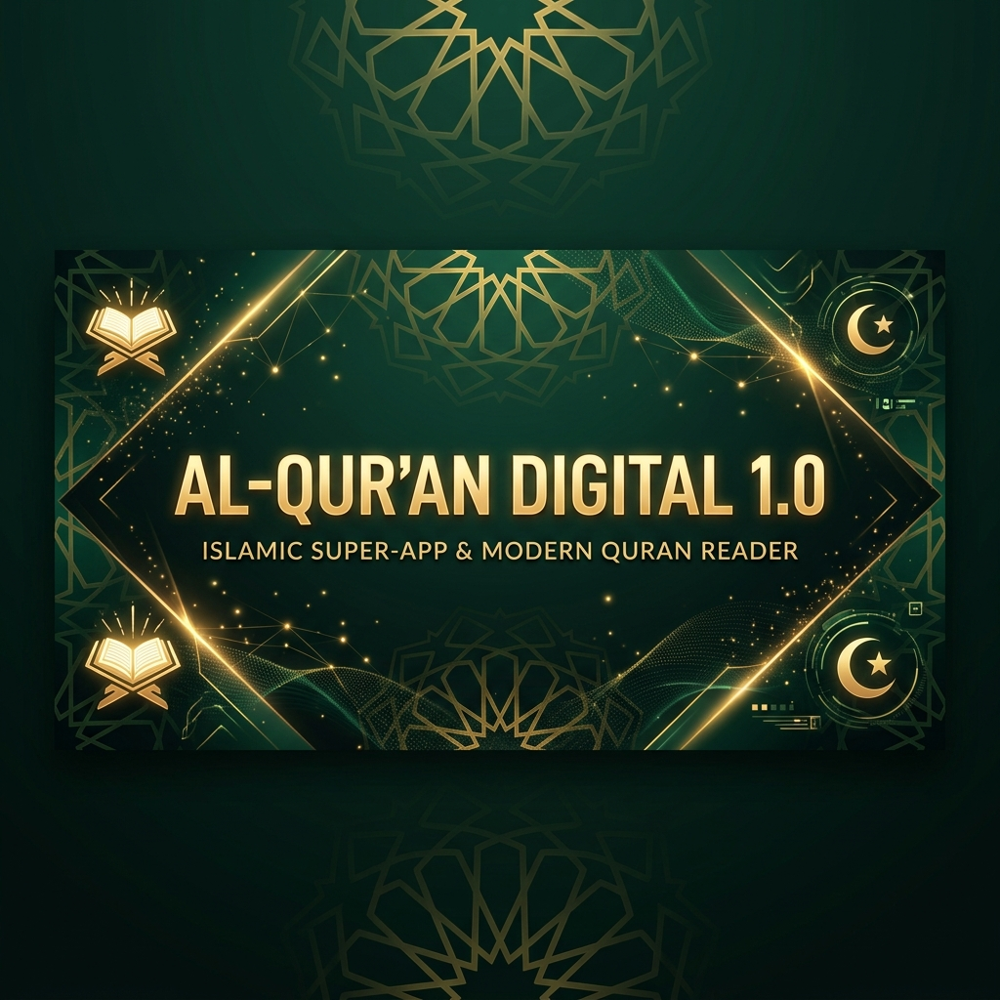
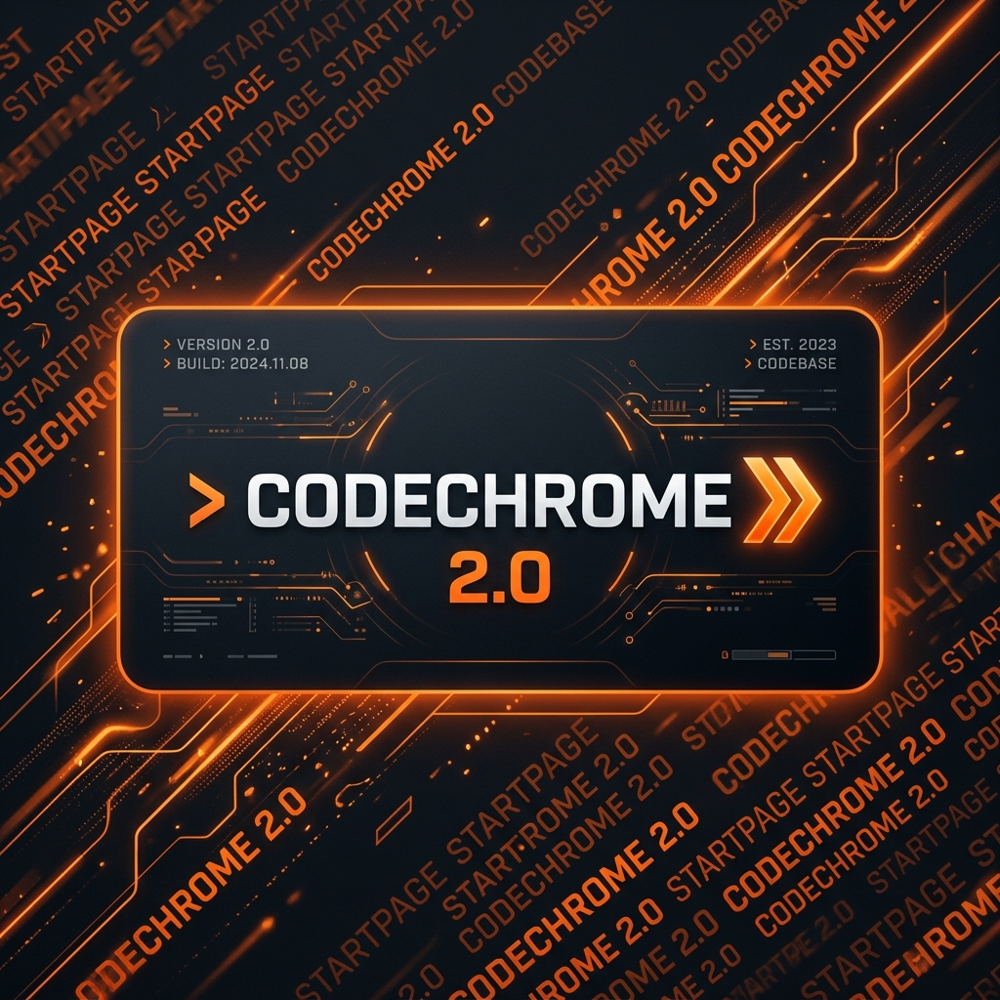
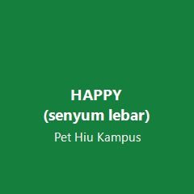

 

### 🌌 Exploring CyberSecurity • Crafting AI-driven Web Apps • Engineering 3D UI

I'm an informatics student passionate about building highly interactive, scalable, and premium web applications. My arsenal spans from hardware-accelerated frontend motion to strict statically-typed backend orchestration.

🎓 **Computer Science Student (S1)** @ Universitas Lambung Mangkurat (FMIPA)  
🏫 **Alumni** @ SMKN 1 Banjarmasin (TJKT)

 

  

## 🚀 Featured Projects

<table>
  <tr>
    <td colspan="2" valign="top">
      <h3 align="center">🕋 Zadify</h3>
      
Islamic Super-App integrating Web Audio, Gemini AI, and 3D Qibla Compass.

      

        
      

      

        
        
      

    </td>
  </tr>
  <tr>
    <td valign="top" width="50%">
      <h3 align="center">⌨️ CodeChrome</h3>
      
Keyboard-first AI Startpage with procedural audio engine.

      

        
      

      

        
      

    </td>
    <td valign="top" width="50%">
      <h3 align="center">🚜 Game-Farm-2.0</h3>
      
Browser 2D farming sim built entirely on pure Canvas API & Vanilla JS.

      

        <a href="https://github.com/RahmannCH/Game-Farm-2.0">
           <!-- Placeholder SVG since local screenshot wasn't found -->
          
        </a>
      

      

        
      

    </td>
  </tr>
  <tr>
    <td valign="top" width="50%">
      <h3 align="center">🦈 VirtualPet DFA</h3>
      
College student simulation governed by a Deterministic Finite Automaton (Automata Theory).

      

        
      

      

        
      

    </td>
    <td valign="top" width="50%">
      <h3 align="center">🖥️ Personal Portfolio</h3>
      
Futuristic dark UI with cyan/neon accents, typing animation, and Konami code easter egg.

      

        
      

      

        
      

    </td>
  </tr>
</table>

  

## ⚡ Technical Arsenal

**Core Languages**  

**Frameworks & Libraries**  

**Databases & Infrastructure**  

  

## 📊 Analytics & Impact

  
  

 

  

  

### 🏆 Achievements

  

---

  

